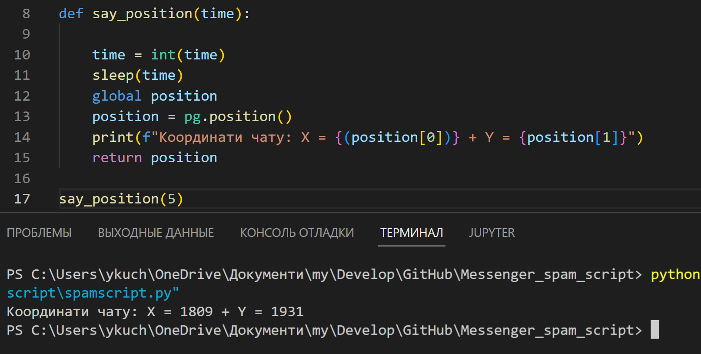

# Messenger_spam_script (1.0)

Ідея проекту це створити скрипт який дозволить автоматично спамити у соц мережі потрібний текст.

## Як це працює

Для початку нам потрібно дізнатись координати чату, на кожному моніторі різні розширення, тому координати будуть різними.
Щоб дізнатись свої координати застосовуємо функцію "say_position" у яку передаємо параметр time це затримка у часі перед тим як вивести координати курсора миші. Запускаємо функцію після чого переходимо у потрібний чат та наводимо курсор миші на поле де ми вписуємо текст.

Тепер коли ми знаємо координати можемо викликати функцію "spam" у яку передаємо наступні параметри:

- position - позиція поля вводу у чаті (можна получити завдяки функції say_position).
- number - кількість повідомлень для спаму.
- message - текст повідоомлення.
- time - час, після якого функція почне спамити.

Після запуску функції ми переходимо у цей самий чат де взнавали координати та скрипт починає спамити :)